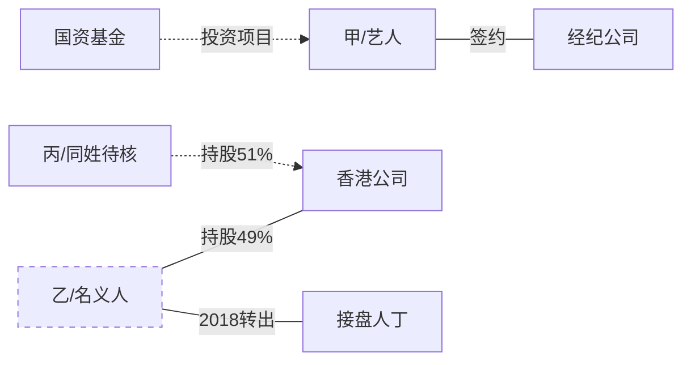
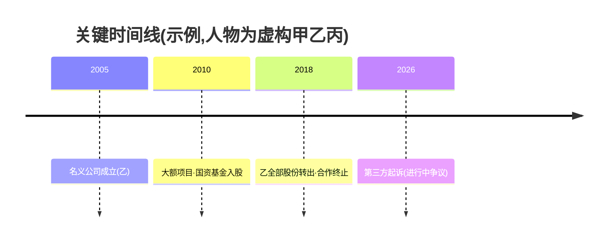

# 专业调查报告的完整交付结构

skill 过去的毛病是"直接给一段结论"。一份专业情报产品(intelligence product)不是一段话,而是
一套**可独立核验、可复用、可移交**的文档:执行摘要、人物画像、实体关系图、事件时间线、事件
叙述、证据台账、假设矩阵、附录。本文件规定这套结构、每个部件的规范,以及用什么工具、怎么在
markdown/artifact 里真正画出来。

参考:Bellingcat 工具库、Dutch OSINT Guy / Mirko Lapi 的报告写作规范、行业模板(BLUF + 三层
证据分级 + chain of custody)。

## 目录
- 何时出全量报告 vs 精简答复
- 报告部件(0–12)
- 三层证据分级(贯穿全篇)
- 关系图 / 时间线怎么画(mermaid)
- 工具集
- 交付形态与合规

## 何时出全量报告 vs 精简答复

按**关键问题的重要性、已积累的实体/证据量、以及继续调查的信息增益**判断,不看固定轮数:

- **一次性小问题**(核一个说法真假):精简答复即可——BLUF + 关键证据 + 存疑,别硬凑十二节。
- **人物/主体/复杂事件的深调**:出全量报告。当调查已牵出多个相互关联的实体、时间线开始成形、
  或用户要用它做实际决策时,就该沉淀成一份带关系图、时间线、证据台账的 dossier,而不是每轮
  丢一段结论、最后什么都没留下。
- 判断"要不要继续/要不要升级到全量":看再查一轮的**预期信息增益**是否还高、事情的**重要性**
  是否值得、以及用户的**时间与预算**——增益递减且关键问题已够回答,就收口成报告。

## 报告部件

**0. 报头 / 元数据**:调研问题(KIQ,一句话)、用途、报告编号与日期、作者、**范围与范围外**
(明确说不查什么)、适用法域。

**1. 执行摘要 / BLUF**(Bottom Line Up Front,一页内):直接回答 KIQ、支持哪个假设、整体置信度
(校准语言)、最关键的 1–3 条依据。让不看正文的人也能拿去做判断。

**2. 范围与方法**:查了什么、怎么查、用了哪些源并标优先级(**一手 vs 二手**、公开/付费/登录墙)。
说清没查到的地方和为什么(工具/权限/覆盖限制)。读者关心发现,方法从简但要可复现。

**3. 发现(按主题或关键问题分组,不按时间罗列)**:每条发现**自足**——写清"查到什么 / 来自哪 /
何时 / 置信度",不逼读者跳页。用三层证据分级(见下)。

**4. 人物画像 / 主体档案(dossier)**:身份与消歧依据、履历与任职、资产与资金痕迹、关系网、
行为模式,以及**全域公开轨迹**(不只社媒——按 `public-trace-index.md` 的轨迹领域矩阵:教育/
职业/商业/司法/学术/社会参与/公开表达/技术/历史档案,做成一张"轨迹矩阵"或"轨迹时间线")。
**事实与推断分层**,每条轨迹注明"证明什么、不证明什么";敏感个人信息按内核 5 合规约束。

**5. 实体关系图(link chart)**:人—公司—资金—事件的节点和边,一张图看清谁连着谁。用 mermaid
渲染(见下)。这是复杂案子最值钱的部件——一桩牵出十几个实体的追查,价值往往能浓缩成一张
"名义人—直接关联人—接盘人—出资方"关系图。

**6. 事件时间线**:每个节点记**双时间戳**(事件发生时间 / 信息发布时间),声明的发布时机也记。
用 mermaid timeline 或表格。

**7. 事件叙述(narrative)**:把时间线和关系串成一段可读的故事,每个关键情节挂上支撑证据的编号。
这是让"非调查员也能读懂并复述"的部件。

**8. 假设矩阵(ACH)+ 关键假设检查 + 敏感性 + 置信度**:见 methodology.md 和 templates.md。

**9. 证据台账 / 来源留痕**:每条关键证据的采集记录——主张/网址/发布者/双时间戳/原文摘录/
**存档链接**(或本地留存)/评级/独立性/支持哪个假设。做缺席判断的另附"缺席确认台账"。模板见
templates.md。目的:任何人拿着台账能原样复核,证据在对方删除后仍可追溯。
- **术语别用错**:截图 + 链接 + 时间戳只是"证据台账/来源留痕"。只有当你记录了**原件、哈希值、
  采集人、采集环境、不可变存储、流转过程**时,才谈得上真正的"证据保全链(chain of custody)"
  ——那通常要 Hunchly 这类工具或正式取证流程。普通公开调研做到"台账 + 存档 + 哈希"即可,
  别把台账说成保全链(在法律语境里这个区别很实在)。

**10. 查不到 / 存疑 / 内部待核线索**:分两层——交付报告只放少量关键未知项;相关、可追溯、
有核实路径的线索进"内部调查日志"继续追(见 reading-signals.md)。

**11. 未来观察指标**:出现什么(档案解密、判决书、当事人发声、新痕迹)会让结论改判。

**12. 免责与合规**:公开合法渠道声明、事实与推断分层声明;不构成对个人的最终判定(见内核 5)。
**右答复权(right of reply)——场景触发,非每报告必填**:当报告含**针对可识别个人的重大不利
主张,且拟对外发布、提交监管或用于高影响决策**时,应评估是否需给回应机会。纯内部探索性研究
记"尚未征求回应"即可。**主动对外联系对象必须由用户明确授权**;未授权时只拟核实问题清单,
skill 不擅自发起外部联系。

## 三层证据分级(贯穿全篇,每条发现都要挂;按证据实质判,不机械数来源数量)

- **已确认**:存在**足以直接支持该主张的可核验证据**;关键、争议或不利主张已完成**与风险相称
  的独立印证**。
- **有支持但未确认**:有真实来源支持,但身份、含义、独立性或关键环节仍未核实。
- **未证实**:只有薄弱线索、循环引用、或无法确认来源的信息。
- **更严格门槛(优先级最高)**:涉及**个人负面、私人事项或重大权益决策**时门槛抬高——
  **两个二手报道不能替代直接证据**(二手常同源);这类"已确认"要求可核验的一手件或相互独立、
  各自有直接获取能力的来源。
语气中立、描述性而非指控性;用"数据显示/倾向于"而非绝对断言。

## 关系图 / 时间线怎么画(我们的产出用 mermaid,artifact 可直接渲染)

**实体关系图**——用 mermaid `graph`,节点标类型、边标关系:

(虚线/注记标"推断"或"待核",别把推断画成实证关系;丙与乙是否亲属未证实,故用虚线。)

**时间线**——用 mermaid `timeline` 或表格:

复杂网络若 mermaid 画不下,退到表格(边列表:源节点|关系|目标节点|证据编号|评级)。

> ⚠️ 上面的甲/乙/公司A 只是本文件的**占位示例**。真实交付**按主文件的分版本规则处理**:内部
> 完整报告保留关键主体真名(免得匿名导致关系失真);对外版本对无关第三方、未成年人和待核阶段的
> 个人按必要性匿名。匿名占位只是 skill 文档写法,不是"交付一律真名"。

## 工具集(会话内够不到的标为"用户侧")

- **链接分析 / 关系图**:Maltego(OSINT 图分析主力;证据留痕工具 Hunchly 已于 2025 年 5 月被
  Maltego 收购)、i2 Analyst's Notebook(重型);轻量 = yEd / draw.io / Obsidian graph;
  **文本交付 = mermaid graph**。
- **时间线**:Aeon Timeline、TimelineJS;文本交付 = mermaid timeline / 表格。
- **证据保全 / chain of custody**:**Hunchly**(专门的网页证据留存工具,边浏览边自动抓取、留
  时间戳和哈希;用户侧);会话内退而求其次 = 截图 + 存档链接 + 证据台账手工维护(达不到完整
  保全链,见部件 9)。
- **登录墙内的一手源**:用 ego-browser 或浏览器(用户登录、我来检索),见 china-sources.md。
- 工具能力**条件式使用**:环境支持时优先用交互式成品/关系图工具;不支持时退回表格、普通
  Markdown、截图和本地存档。任何单个平台都是能力示例,不是必须项。工具会改版,检索时复核当前
  可用性。

## 交付形态与合规

- 环境支持时,复杂报告可出成 **artifact**(HTML,mermaid 图直接渲染);不支持则 markdown 文件
  + mermaid 代码块 / 表格。按环境选,不强求某一种形态。
- 证据分级、事实/推断分层、合规声明是可核验的质量要素,应保留(避免"专业/业余"这类不可验证
  的主观评价措辞)。
- 涉重大权益决策(招聘/授信/投资)只用"已确认"层,未证实的个人负面材料不进决策(见 reading-signals.md)。
